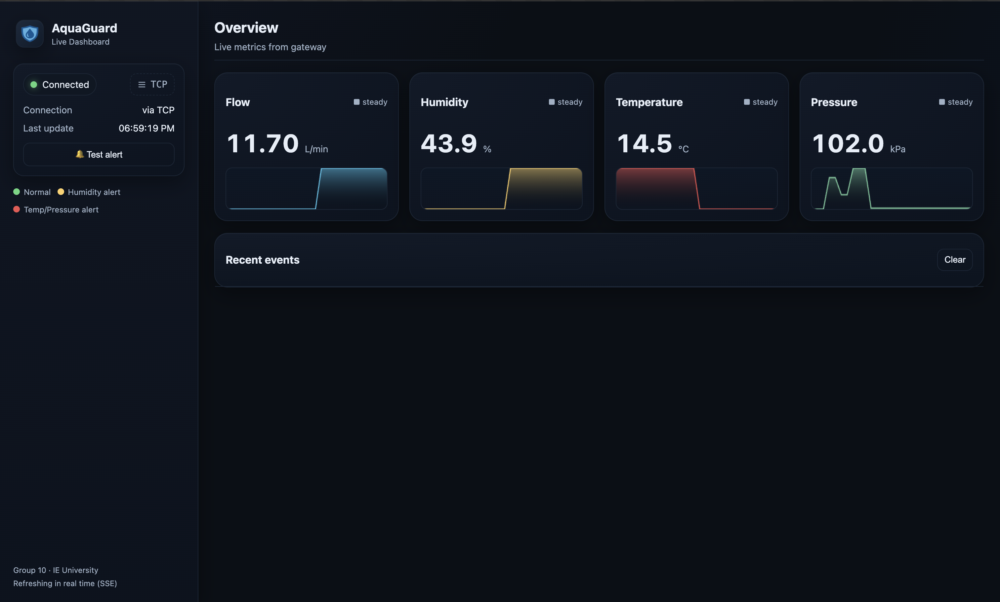

# AquaGuard C Data Platform — Live Water-Safety Dashboard

Live C gateway with TCP/Sim ingest and SSE-powered web dashboard for real-time water safety.

## Overview
AquaGuard ingests sensor JSON from either a Python TCP simulator or SIM mode, parses it in C, and streams live metrics to a browser via Server-Sent Events. The simulator is a drop-in replacement for the real Arduino IoT hardware, emitting the exact sensor packets (flow, humidity, temperature, pressure, leak conditions) over TCP so the C gateway and dashboard behave identically with or without the device. The dashboard tracks metrics and connection state, raising an emergency banner when thresholds are crossed using an alert bitmask. Built with production hygiene in mind: CMake build, CTest, CI, and concise dependencies.



## Tech Stack
C (POSIX sockets, pthreads) · CMake/CTest · Python (Tk TCP simulator) · HTML/CSS/JS + SSE · Conda env

## Features
- TCP mode: connect to Python simulator at `127.0.0.1:5555` (mirrors Arduino device packets).
- SIM mode: generate internal sensor data for demos without TCP.
- Two-thread C gateway: TCP ingest + HTTP/SSE server sharing mutex-guarded `SensorData`.
- Alert bitmask covering flow high/low, humidity, temperature, and pressure thresholds.
- Live dashboard at `http://localhost:8080` with connection status and emergency banner listing active issues.
- Minimal JSON parser, `SIGPIPE` ignored so browser reloads never kill the process.

## Architecture

Two-thread model: one thread maintains the TCP client to read JSON from the simulator/Arduino-equivalent, while the second serves HTTP and streams SSE events on `/events`. Parsed values populate a shared struct; alerts are computed via bitmask and pushed instantly to the UI.

## Quick Start
```bash
conda env create -f environment.yml && conda activate aquaguard-c
cmake -S . -B build -DCMAKE_BUILD_TYPE=Release && cmake --build build -j
./build/aquaguard --mode tcp --tcp-host 127.0.0.1 --tcp-port 5555 --web-port 8080   # gateway (TCP)
python simulator_py/gui_simulator.py                                                 # simulator GUI -> Start Server
# No TCP? Use ./build/aquaguard --mode sim --web-port 8080
```
Open `http://localhost:8080` for the dashboard.

## Requirements
- CMake 3.16+ and a C compiler with pthreads/POSIX sockets.
- Python 3 with Tkinter for the simulator (Conda environment recommended).
- Conda/Mamba (optional but recommended) for reproducible deps.
- Modern browser for the dashboard.

## Alerts & Thresholds
- Flow high: > 45 L/min
- Flow low: < 0.3 L/min
- Humidity high: > 80 %
- Temperature high: > 50 °C
- Pressure high: > 120 kPa

Threshold breaches set the alert bitmask, mark metrics in red, and display an emergency banner until values normalize.

## How It Works
- Simulator equivalence: the Python GUI emits the same JSON packets as the Arduino device, so the gateway/web app operate identically in TCP mode or with real hardware.
- Gateway ingest: TCP thread parses JSON into shared `SensorData`, computing alert bits.
- Web delivery: HTTP thread serves static assets and streams SSE updates on `/events`; browser updates without reloads.
- Modes: `--mode tcp` listens to the simulator/device; `--mode sim` generates internal data for offline demos.

## Screenshots


## Project Structure
```
.
├── CMakeLists.txt
├── include/
│   ├── http.h
│   ├── json.h
│   ├── log.h
│   ├── sensor.h
│   └── shared.h
├── src/
│   ├── http.c
│   ├── json.c
│   ├── main.c
│   └── sensor.c
├── web/
│   ├── assets/
│   │   └── logo.svg
│   ├── index.html
│   ├── style.css
│   └── app.js
├── simulator_py/
│   └── gui_simulator.py
├── tests/
│   └── test_parser.c
├── environment.yml
├── .github/workflows/ci.yml
└── README.md
```

## Academic Context
C programming project tying course modules: error handling/testing (parser checks, CTest), pointers/structs (mutexed `SensorData`), preprocessor use (threshold constants), file I/O (static asset serving), and networking/concurrency (POSIX sockets, pthreads, SSE).

## Known Limitations
- Localhost demo only; no TLS/auth.
- Single sensor stream; no history or persistence.
- Minimal JSON parser assumes well-formed input.
- SSE only (no WebSocket fallback).

## Future Work
- Multi-sensor ingestion with history/charts.
- Hardened validation and telemetry.
- Docker packaging and cross-platform binaries.
- Optional TLS/auth and WebSocket transport.

## Troubleshooting
See `TROUBLESHOOTING.md` for full installation issues and macOS tkinter fixes.

## Credits
- ADRIA FIJO GARRIGA — 25%
- HERNAN CHACON — 25%
- JAD EL AAWAR — 25%
- ZAID AYMAN SHAFIK JUMEAN — 25%

## License
MIT
